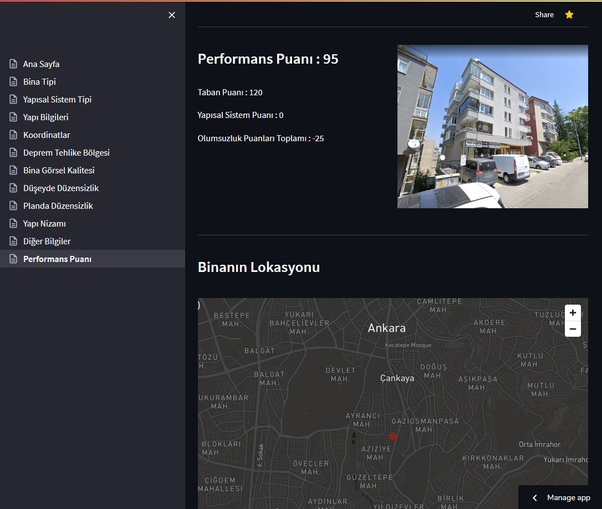
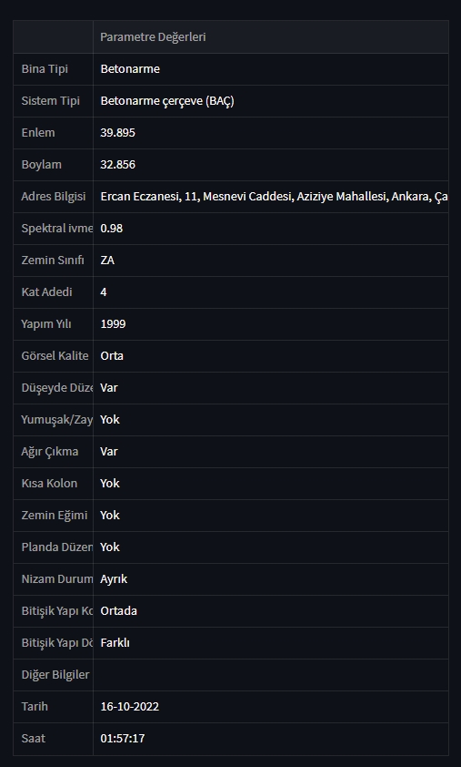

# Bina-Risk-Dagilimi
Uygulama ile taşıyıcı sistemi betonarme ve yığma olan binaların risk dağılımı, aşağıdaki yayınlanmış esaslara göre yapılmaktadır.

https://webdosya.csb.gov.tr/db/altyapi/icerikler/r-skl--yapilarin-tesp-t-ed-lmes-ne-il-sk-n-esaslar-20190218134628.pdf

Gerekli kütüphaneler:

streamlit	(https://docs.streamlit.io/library/get-started/installation)

Pillow (PIL)	(https://pillow.readthedocs.io/en/stable/installation.html)

GeoPy

Pandas

mysql.connector
